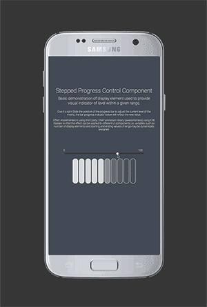

#Overview
UI excersize, demonstrating an HTML based control which provides a visual indicator of a value within a specified range.

 

##Technology stack:
- Node based project
- ES6/babel based build process
- Greesock based API
- Mocha/Chai test coverage

##Setup

###Testing
`npm run-script test`

###Building
`npm run-script build`

###Running
Recommended execution environment, npm reload package (https://www.npmjs.com/package/reload)

cd [project directory]
reload
http://localhost:8080

